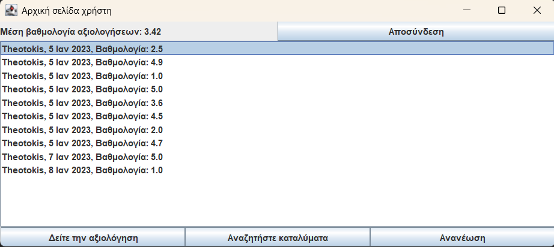

# MyReviews

Welcome to **MyReviews**, a student project to showcase the process of finding, reviewing and uploading accommodations. Whether you're a provider looking to showcase your properties or a user searching for the perfect place to stay, MyReviews has you covered.

---

## Features

- **For Providers**: Upload and manage accommodations.
- **For Users**: Search for accommodations using filters.
- **Ratings and Reviews**: Share your experience by rating and reviewing accommodations.

---

## Getting Started

### Pre-existing Users

To explore the app, you can log in using the following credentials:

| **Role**      | **Username** | **Password**  |
|---------------|--------------|---------------|
| Provider      | provider1    | password1     |
| Provider      | provider2    | password2     |
| User          | user1        | password1     |
| User          | user2        | password2     |

---

## How It Works

1. **Providers**: Upload your accommodations, including details and amenities.
2. **Users**: Search for accommodations based on your preferences and leave reviews.

## Screenshots

Here are some screenshots to help you get familiar with the app:

### Login/SignUp Choice

### Login

### User's Dashboard

### Search Accomodations

### Accomodation page

---

We hope you enjoy exploring the app.

